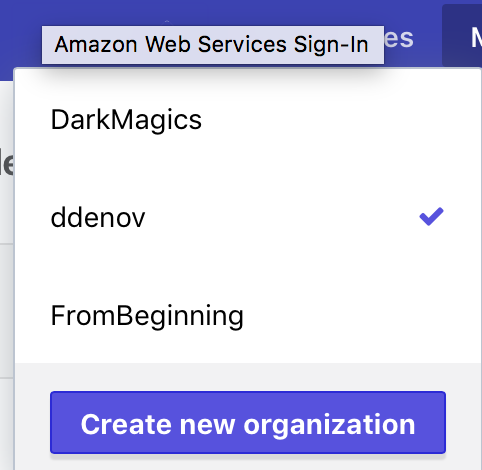
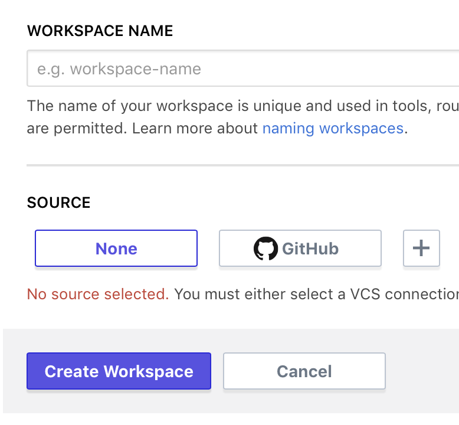
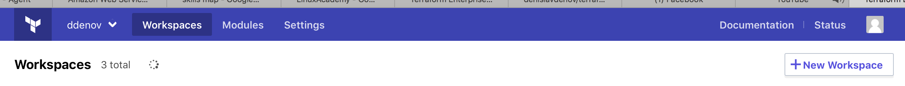

# Sample repo showing how to store your Terraform state file on a remote backend on Terrraform Enterprise Atlas backend

1. Create Terraform Enterprise account.
2. Create a main.tf file with a null resource or any other
   ```
   resource "null_resource" "helloWorld" {
     provisioner "local-exec" {
       command = "echo hello world"
     }
   }
   ```
3. Run `terraform init` and `terraform apply` so you create a local state file first.
4. Add `.terraform` folder and `terraform.tfstate*` to `.gitignore` if you are going to use this code within GH repo
5. Go to Terraform Enterprise and create and organization and a new workspace choosing None as a source.

 
 


6. Add the following code to your main.tf file
   ```
   terraform {
     backend "atlas" {
       name    = "org/workspace"
     }
   }
   ```
7. You need to go to your user's settings in TFE and create a new Token and copy it somewere.


8. Run `terraform init` in order initialize Terraform with the new backend that is going to be used.
   You are going to be asked for your access token that you just created.
   You have to confirm that you want to copy your current local state file to the new backend.

**You can do multiple terraform destroy and apply and check the State section of your workspace to see the changes.**
